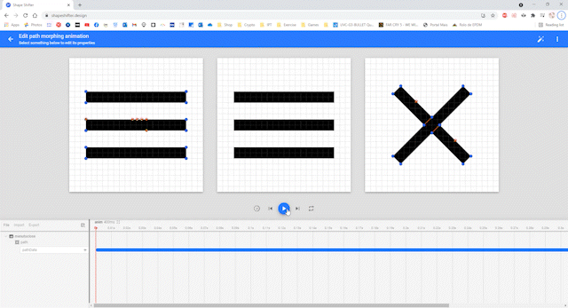
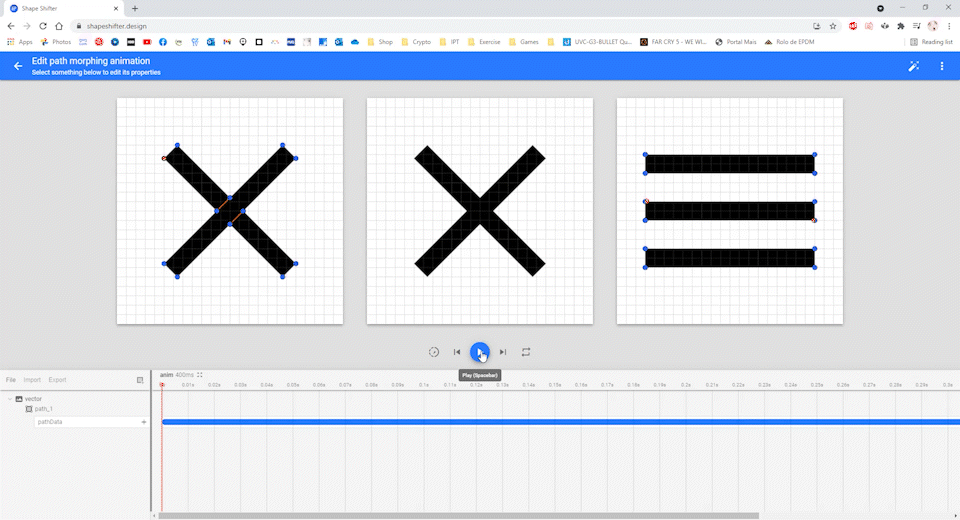
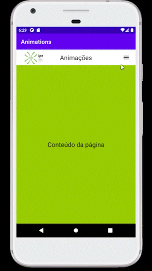

# Animações

Exemplos de várias animações utilizadas durante o estágio

## Shape Shifter

O Shape Shifter permitiu criar animações para transformar ícones

### Animação ícone de menu para ícone de fechar

### Animação ícone de fechar para ícone de menu

## Aplicação exemplo

Na aplicação exemplo foram aplicadas tanto as animações dos ícones como as animações do valor da altura da página de modo a resultar na experiência completa esperada

